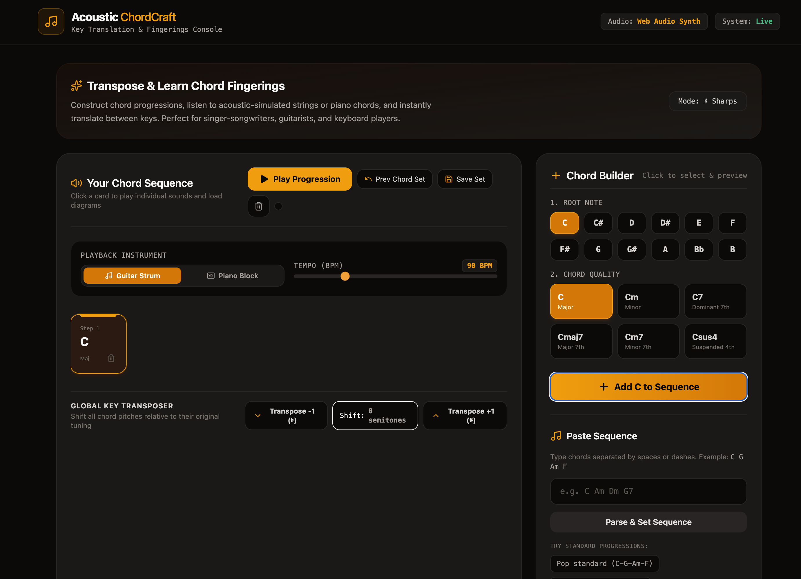
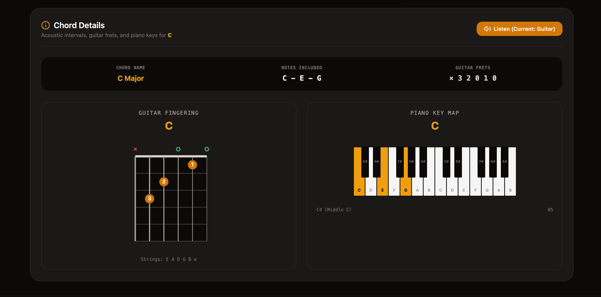

# Chord Converter & Fingering Tool

**Live app:** [chord-converter-and-fingering-tool.vercel.app](https://chord-converter-and-fingering-tool.vercel.app/)




## What it does

Don't have perfect pitch? Struggle to replicate a song by ear, or find yourself relying on notes without knowing how to actually place your fingers?

This tool solves that problem — it translates any chord or note into its correct sound and shows you the exact fingering position on **guitar** or **piano**. If it sounds right to you, you'll know exactly how to play it.

No music theory background required. Just find the sound you're looking for, and the tool shows you where to put your fingers.

## Features

- Convert chord names/notes into sound
- Visual fingering positions for guitar
- Visual fingering positions for piano
- Save chord sequences for later (saved locally in your browser)

## Getting Started (Local Development)

Clone the repo and install dependencies:

```bash
git clone https://github.com/yuezhang87/Chord-converter-and-fingering-tool.git
cd Chord-converter-and-fingering-tool
npm install
```

Run the app locally:

```bash
npm run dev
```

Build for production:

```bash
npm run build
```

## Tech Stack

- Vite
- TypeScript
- React

## Notes

Saved chord sequences are stored in your browser's local storage. Clearing your browser data or switching devices/browsers will not carry over saved sequences.

## License

Add your license here (e.g. MIT), or note that this is a personal project not currently licensed for reuse.
